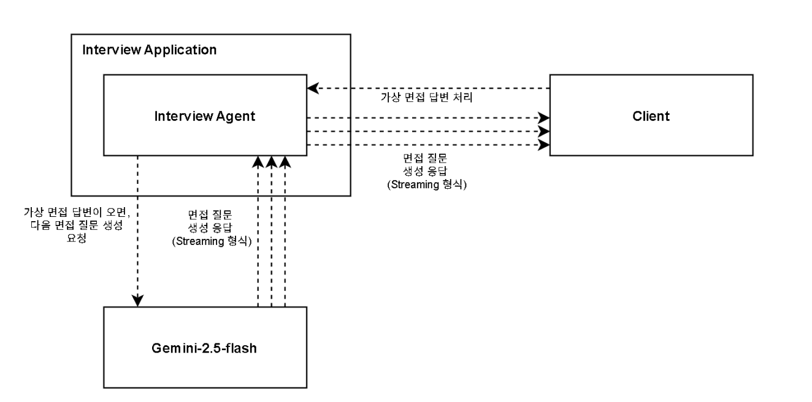

# [Technical Deep Dive] Spring WebFlux와 Redis로 구축한 LLM 스트리밍 파이프라인 여정기

AI 기반의 대화형 서비스에서, 사용자 경험의 질은 응답 속도와 ‘자연스러움’에 의해 결정됩니다. 저희는 AI 면접관 프로젝트를 시작하며 한 가지 핵심 원칙을 세웠습니다: **"AI와의 상호작용은 사람과의 대화처럼 느껴져야 한다."** 이 원칙은 단순히 응답을 빠르게 반환하는 것을 넘어, AI가 생각하고 말하는 듯한 실시간 스트리밍 경험을 구현해야 한다는 기술적 목표로 이어졌습니다.

이 글은 이 목표를 달성하기 위해, **Spring WebFlux** 의 반응형 세계에 뛰어들어 **Langchain4j** 가 뿜어내는 `Flux` 스트림을 다루고, **Redis**를 핵심 도구로 사용하여 안정적인 데이터 파이프라인을 구축하기까지의 기술적 여정과 의사결정 과정을 상세히 공유합니다.

## 1. 아키텍처 설계: 올바른 질문에서 시작된 기술 선택

본격적인 개발에 앞서, 우리는 여러 갈림길에서 중요한 기술적 질문에 답해야 했습니다.



#### 질문 1: 어떤 I/O 모델을 선택해야 하는가? (WebFlux의 필연성)

가장 먼저 결정해야 할 것은 서버의 I/O 모델이었습니다. 전통적인 Spring MVC의 스레드-퍼-리퀘스트(thread-per-request) 모델은 LLM 스트리밍처럼 응답 대기 시간이 긴 작업에 치명적입니다. 수백 명의 사용자가 동시에 면접을 본다고 상상해 보십시오. 각 연결마다 서버 스레드가 하나씩 할당되어 LLM의 응답을 하염없이 기다린다면, 서버는 순식간에 스레드 고갈로 응답 불능 상태에 빠질 것입니다. 이는 최적화의 문제가 아니라, 서비스의 실행 가능성 자체의 문제였습니다.

따라서, 적은 수의 스레드로 수많은 동시 연결을 효율적으로 처리하는 **논블로킹(Non-blocking) 반응형 아키텍처** 는 선택이 아닌 필수였습니다. 이는 자연스럽게 저희를 **Spring WebFlux** 로 이끌었습니다.

#### 질문 2: 어떤 프로토콜로 데이터를 전달할 것인가? (SSE의 합리성)

실시간 데이터 전송을 위해 WebSockets와 SSE(Server-Sent Events)를 저울질했습니다. WebSockets는 강력한 양방향 통신을 지원하지만, 저희의 요구사항은 서버에서 클라이언트로 향하는 **단방향 스트리밍**이었습니다. 이 경우, WebSockets는 필요 이상의 복잡성을 야기할 수 있었습니다. 반면, **SSE**는 이 목적에 정확히 부합하는 경량 HTTP 기반 표준 프로토콜이었습니다. 클라이언트 측에서 별도의 라이브러리 없이 네이티브 `EventSource` API로 쉽게 구현할 수 있다는 점 또한 큰 장점이었습니다. 우리는 가장 직관적이고 합리적인 도구인 SSE를 선택했습니다.

#### 질문 3: LLM과는 어떻게 대화할 것인가? (Langchain4j의 유연성)

LLM 연동을 위해, Spring 생태계의 일원으로서 `spring-ai` 프로젝트를 가장 먼저 검토했습니다. 하지만 당시 `spring-ai`는 Google Gemini API를 직접 지원하지 않고, Vertex AI 플랫폼을 통해서만 접근이 가능했습니다. 저희 프로젝트는 Gemini API 직접 호출을 목표로 했기에, 이 점은 중요한 제약 조건이었습니다.

대안을 찾던 중 **Langchain4j**를 발견했습니다. Langchain4j는 저희가 원했던 **Gemini API 스트리밍을 직접 지원**했을 뿐만 아니라, 더 큰 매력을 가지고 있었습니다. 바로 여러 LLM 호출이나 외부 도구 사용을 논리적으로 연결하는 **'체이닝(Chaining)' 아키텍처**였습니다. 이는 당장의 문제를 해결하는 것을 넘어, 향후 더 복잡한 대화 흐름이나 기능을 구현할 때 높은 유연성을 제공할 것이라는 확신을 주었습니다. Langchain4j는 실용성과 미래 확장성 모두를 만족시키는 선택이었습니다.

## 2. 구현 과정의 시련과 해법

올바른 도구를 선택했지만, 실제 구현의 길은 순탄치만은 않았습니다.

#### 시련 1: 30초의 미스터리 - 말없이 끊기는 스트림

초기 코드는 로컬에서 완벽하게 동작했지만, 개발 서버에 배포하자 스트림이 약 30초 후에 아무런 오류 없이 중단되는 현상이 발생했습니다. 오랜 디버깅 끝에, 원인이 인프라단의 네트워크 프록시나 로드 밸런서에 있음을 발견했습니다. 이들은 일정 시간 동안 데이터 흐름이 없으면, 해당 연결을 '유휴 상태'로 간주하고 소리 없이 종료해버렸던 것입니다.

**해결책: SSE Heartbeat**

이를 해결하기 위해 주기적으로 '하트비트(Heartbeat)'를 보내는 메커니즘을 구현했습니다. 20초마다 클라이언트가 무시하는 주석 메시지(`: heartbeat`)를 보내는 별도의 `Flux`를 생성하고, 이를 원본 데이터 스트림과 `Flux.merge()`로 병합했습니다. 이 간단한 조치로 네트워크 연결이 활성 상태로 유지되어 스트림의 안정성을 확보할 수 있었습니다.

#### 시련 2: 상태 없는 스트림의 배신 - 데이터 유실

다음 문제는 사용자가 페이지를 새로고침하거나 네트워크가 불안정했을 때 발생했습니다. 스트림은 상태가 없었기에(stateless), 사용자는 대화의 앞부분을 놓치고 중간부터 보게 되었습니다. 더 심각한 것은, 스트림이 어떤 이유로든 중간에 종료되면 전체 대화 내용이 어디에도 저장되지 않아 데이터가 영구적으로 유실된다는 점이었습니다. 우리는 스트림을 위한 **'단기 기억장치'**, 즉 실시간 버퍼가 필요했습니다.

**해결책: Redis, 스트림의 단기 기억장치가 되다**

이 버퍼는 여러 서버 인스턴스 간에 공유되어야 했고, 매우 빠른 쓰기 속도를 요구했습니다. RDBMS는 토큰 단위의 빈번한 쓰기 작업에 부하가 너무 컸습니다. 해답은 저희가 이미 캐싱 용도로 사용하던 **Redis**였습니다. In-memory 기반의 빠른 속도와 List 자료구조의 효율적인 `RPUSH` 연산은 저희의 요구사항에 완벽하게 부합했습니다.

데이터 파이프라인은 다음과 같이 재설계되었습니다.

1.  `Langchain4j`로부터 `Flux` 스트림이 시작된다.
2.  `.doOnNext()` 연산자를 사용해 스트림을 가로채, 각 토큰을 클라이언트로 전송함과 동시에 Redis List에 `RPUSH`한다.
3.  `.doFinally()` 연산자를 사용해 스트림이 어떤 식으로든 종료될 때, Redis에 저장된 토큰 리스트를 읽어와 완전한 문장을 만들어 RDB에 저장하고, Redis 버퍼를 삭제한다.

```java
// 최종 파이프라인의 개념적 구조
public Flux<String> startStreaming(Long sessionId, String message) {
    String bufferKey = "room:" + sessionId + ":buffer";

    return llmStreamingModel.stream(message)
        // doOnNext: 스트림의 각 요소에 대해 부수 효과(side-effect)를 발생시킴
        // 여기서는 Redis에 토큰을 기록하는 역할을 함
        .doOnNext(token -> {
            redisTemplate.opsForList().rightPush(bufferKey, token);
        })
        // doFinally: 스트림이 성공, 실패, 취소 등 어떤 이유로든 종료될 때 항상 실행됨
        // 데이터의 최종 저장과 리소스 정리를 보장하는 데 필수적임
        .doFinally(signalType -> {
            List<String> bufferedTokens = redisTemplate.opsForList().range(bufferKey, 0, -1);
            String fullMessage = String.join("", bufferedTokens);
            messageRepository.save(new Message(sessionId, fullMessage));
            redisTemplate.delete(bufferKey);
        });
}
```

## 3. 결론

LLM 스트리밍 기능 구현은 단순히 API를 호출하고 `Flux`를 반환하는 것 이상의 과정이었습니다. 그것은 I/O 모델부터 프로토콜, 라이브러리, 상태 저장소에 이르기까지, 각 계층에서 명확한 근거를 바탕으로 최적의 기술을 선택하고 조합하는 건축과도 같았습니다. WebFlux의 반응형 프로그래밍 모델 위에서, SSE의 단순함, Langchain4j의 유연성, 그리고 Redis의 속도를 조화롭게 엮어냄으로써, 우리는 비로소 안정적이고 확장 가능한 실시간 스트리밍 파이프라인을 완성할 수 있었습니다. 이 글에서 공유한 저희의 고민과 결정의 과정이, 유사한 도전에 직면한 다른 개발자분들께 실질적인 도움이 되기를 바랍니다.
