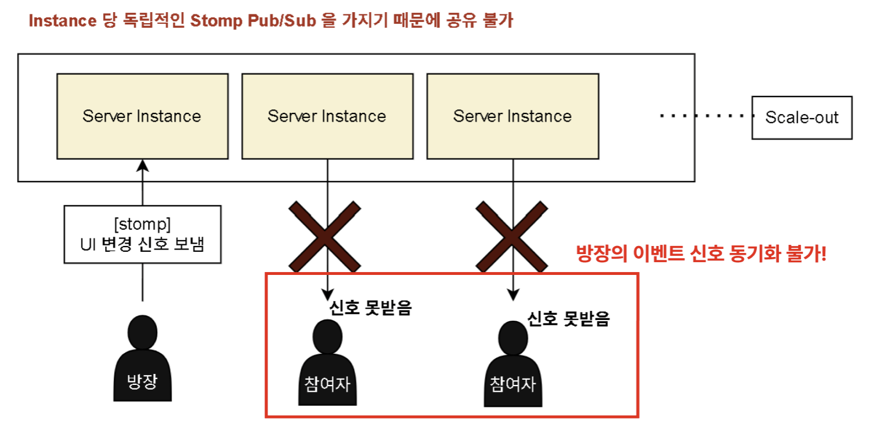
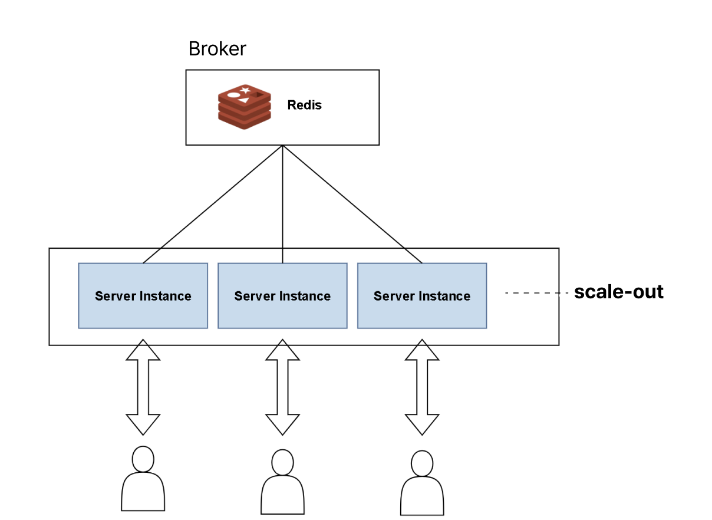
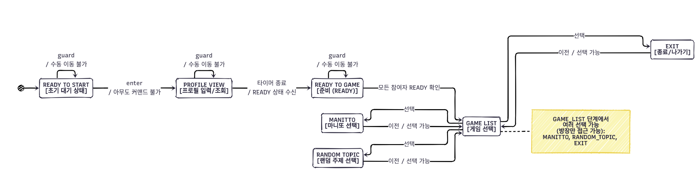

# Spring Boot와 Redis로 분산 실시간 상태 머신 구현하기

> 이 포스트는 멀티-인스턴스 Spring Boot 환경에서 실시간 게임 이벤트를 동기화하기 위해, Redis를 활용한 경량 분산 상태 머신을 직접 구현한 경험을 다룹니다. `Spring Statemachine` 같은 프레임워크 대신 **Java Enum**으로 상태 로직을, **Redis**로 상태 데이터를 관리하고, **Redis Pub/Sub**으로 상태 변경을 전파하여 아키텍처의 복잡성과 외부 의존성을 최소화한 과정을 설명합니다.

---

## 1. The Challenge: 분산 환경에서의 상태 불일치



실시간 아이스브레이킹 게임 플랫폼을 개발하면서, 사용자가 늘어남에 따라 서버를 멀티 인스턴스로 확장했습니다. 스케일 아웃 직후, A 인스턴스에 접속한 방장의 게임 시작 이벤트가 B 인스턴스에 있는 사용자에게 전달되지 않는 심각한 상태 불일치 문제를 겪었습니다.



이 문제를 해결하기 위해 다음과 같은 설계 목표를 세웠습니다.

-   **단일 진실 공급원 (Single Source of Truth)**: 모든 서버 인스턴스는 언제나 동일한 상태 정보를 공유해야 한다.
-   **실시간 전파**: 상태 변경은 지연 없이 모든 참여자에게 즉시 전파되어야 한다.
-   **순서 보장 및 흐름 제어**: 자동화된 서버 타이머와 사용자의 수동 커맨드가 섞여도, 이벤트는 반드시 정해진 순서대로 처리되어야 한다.
-   **단순한 아키텍처**: 새로운 기술 도입으로 인한 장애 포인트를 최소화한다.

## 2. Architecture: Redis와 Enum을 활용한 경량 상태 머신

위 목표를 달성하기 위해 다음과 같은 기술적 결정을 내렸습니다.

#### 상태 저장 및 전파: Redis

저희는 이미 캐싱 용도로 Redis를 사용하고 있었습니다. 따라서 외부 의존성을 추가하지 않기 위해 Redis를 두 가지 목적으로 활용했습니다.

1.  **상태 저장소**: 각 게임방의 현재 상태(`GameState`)를 Redis에 Key-Value 형태로 저장하여 모든 인스턴스가 공유하는 **단일 진실 공급원**으로 삼았습니다.
2.  **메시지 브로커**: `RabbitMQ`나 `Kafka` 같은 별도의 메시지 큐 시스템을 도입하는 대신, **Redis의 Pub/Sub 기능**을 사용해 상태 변경 이벤트를 모든 인스턴스에 실시간으로 전파했습니다. 이를 통해 아키텍처를 단순하게 유지하고 운영 부담을 줄일 수 있었습니다.

#### 이벤트 흐름 제어: Custom Enum State Machine

`Spring Statemachine` 같은 기존 프레임워크는 저희가 해결하려는 문제에 비해 기능이 많고 무겁다고 판단했습니다. 복잡한 설정이나 학습 비용 없이 핵심 기능에만 집중하기 위해, **Java의 Enum**을 사용해 상태별 로직을 캡슐화하는 가벼운 커스텀 상태 머신을 직접 구현했습니다.

### 최종 동작 흐름



1.  이벤트가 발생하면, **Redis에서 현재 상태를 조회**합니다.
2.  커스텀 상태 머신(Enum)이 현재 상태에서 해당 이벤트를 처리할 수 있는지(**Guard**) 검사합니다.
3.  전환이 가능하다면, **새로운 상태를 Redis에 저장**하여 진실 공급원을 업데이트합니다.
4.  상태 변경 정보를 **Redis Pub/Sub으로 발행(Publish)** 합니다.
5.  모든 서버 인스턴스는 이 메시지를 구독(Subscribe)하여, 각자 담당하는 클라이언트들에게 변경된 상태를 전파합니다.

## 3. Implementation: Code-Level Deep Dive

실제 구현의 핵심은 상태의 **데이터(Data)** 와 **로직(Logic)** 을 분리하는 것입니다. 상태 데이터는 Redis가, 상태 로직은 Enum이 담당합니다.

아래는 `GameStateService`와 `GameState` Enum의 핵심 로직을 보여주는 Pesudo code 입니다.

```java
/**
 * 각 게임 상태의 로직(Guard, Action)을 정의하는 Enum
 */
public enum GameState {
    READY_TO_START { /* ... */ },
    PROFILE_VIEW {
        @Override
        public boolean canTransition(GameContext context, GameEvent event) {
            // Guard: READY_TO_GAME 이벤트만 허용
            return event == GameEvent.READY_TO_GAME;
        }

        @Override
        public void onEnter(GameContext context, GameEvent event) {
            // Action: 상태 진입 시 타이머 시작
            context.startTimer(30, () -> {
                context.getStateMachine().handleEvent(GameEvent.READY_TO_GAME, context);
            });
        }
    },
    // ... 다른 상태들

    // 상태별 Guard, Action을 위한 추상 메서드
    public boolean canTransition(GameContext context, GameEvent event) { return true; } // 기본값: 허용
    public void onEnter(GameContext context, GameEvent event) { } // 기본값: 동작 없음
}

/**
 * 상태 머신을 제어하고 Redis와 통신하는 서비스
 */
@Service
public class GameStateService {

    @Autowired private RedisTemplate<String, GameState> redisTemplate;
    @Autowired private RedisPublisher redisPublisher;

    public void handleEvent(GameEvent event, GameContext context) {
        String roomKey = "room:" + context.getRoomId();

        // 1. Redis에서 현재 상태 조회 (Source of Truth)
        GameState currentState = redisTemplate.opsForValue().get(roomKey);

        // 2. Guard: 현재 상태(Enum)의 로직으로 전환 가능 여부 확인
        if (!currentState.canTransition(context, event)) {
            // 처리 불가 로직
            return;
        }

        // 3. 다음 상태 결정 및 Redis에 저장
        GameState nextState = findNextState(event);
        redisTemplate.opsForValue().set(roomKey, nextState);

        // 4. 새로운 상태의 Action 수행
        nextState.onEnter(context, event);

        // 5. Redis Pub/Sub으로 상태 변경 전파
        redisPublisher.publishStateChange(nextState, context.getRoomId());
    }
}
```

## 4. Key Takeaways

이번 경험을 통해 다음과 같은 교훈을 얻었습니다.

-   **의존성을 최소화하라**: 이미 사용하는 기술(Redis)을 다목적으로 활용하면 아키텍처가 단순해지고 안정성이 높아집니다. 새로운 기술 도입은 항상 신중해야 합니다.
-   **문제에 맞는 도구를 선택하라**: 프레임워크는 강력한 도구지만, 때로는 해결하려는 문제에 비해 과할 수 있습니다. 문제의 본질을 파악하고, 필요하다면 가벼운 솔루션을 직접 만드는 것이 더 효과적일 수 있습니다.
-   **데이터와 로직을 분리하라**: 상태의 데이터(in Redis)와 상태의 행위 로직(in Enum)을 분리함으로써, 테스트가 용이하고 확장 가능한 유연한 설계를 얻을 수 있었습니다.
