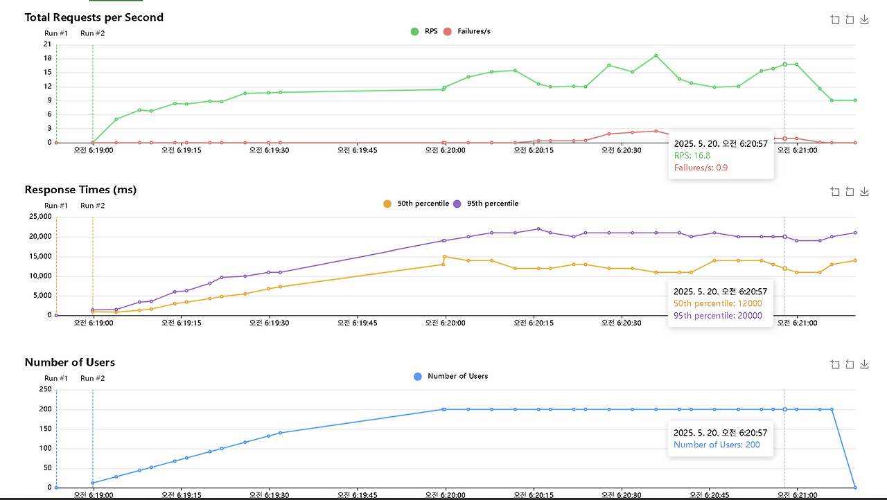

# Spring Webflux 애플리케이션 성능 병목 분석 및 38배 개선기

최신 기술인 Spring Webflux를 도입하여 비동기 논블로킹 기반의 고성능 애플리케이션을 구축하고자 했습니다. 하지만 부하 테스트 결과, `vUser 200명`의 간단한 로그인/회원가입 요청에도 평균 응답 시간이 10초를 초과하고 JVM의 CPU 사용률이 100%에 도달하는 심각한 성능 저하 현상을 발견했습니다.


기대했던 비동기 논블로킹의 이점은 온데간데없고, 애플리케이션은 거의 마비 상태에 가까웠습니다. 이 글은 해당 성능 병목의 원인을 체계적으로 분석하고 해결하여, 최종적으로 **처리량을 3800% 향상**시킨 과정에 대한 기술적인 기록입니다.

## 1. 문제 정의: 부하 테스트 중 발생한 성능 저하

먼저 부하 테스트 중 관찰된 현상을 명확히 정의했습니다.

-   **Symptom**: `vUser 200명`의 부하에서 평균 응답 시간이 **10,000ms**를 초과.
-   **Clue**: JVM CPU 사용률이 **100%** 에 도달했으며, 이와 연동하여 데이터베이스(MySQL)의 CPU 사용률 또한 급증.

CPU 사용률이 100%에 고정된다는 것은 외부 서비스 호출과 같은 I/O 문제가 아닌, 애플리케이션 내부 로직에 CPU-Bound 작업이 존재하여 이벤트 루프를 블로킹하고 있을 가능성이 높다는 것을 시사합니다.


이에 따라, 다음 두 가지를 핵심 분석 대상으로 선정했습니다.

1.  데이터베이스 통신 과정의 비효율성
2.  로그인/회원가입 로직 내 특정 연산의 과도한 CPU 사용

## 2. 원인 분석 1: R2DBC 커넥션 풀 부재

가장 먼저 데이터베이스와의 통신 과정을 점검했습니다. Reactive 환경에서 관계형 데이터베이스와 비동기 통신을 위해 사용하는 R2DBC 드라이버의 동작 방식에 주목했습니다.

**가설**: 매 요청마다 새로운 DB 커넥션을 생성하고 폐기하는 오버헤드로 인해 병목이 발생한다.

가설 검증을 위해 `SELECT 1` 쿼리만 실행하는 단순한 테스트 엔드포인트를 구현하고 부하를 가했습니다. 이 테스트에서도 응답 시간이 1000ms를 초과하며 가설이 사실임을 확인했습니다.

**원인**: R2DBC는 기본 설정상 **커넥션 풀(Connection Pool)을 사용하지 않습니다.** 이로 인해 모든 요청이 물리적인 DB 커넥션을 독립적으로 생성하고 있었고, 이는 심각한 리소스 낭비와 성능 저하를 유발했습니다.

**해결**: `application.yml`에 R2DBC 커넥션 풀 설정을 추가하여 문제를 해결했습니다.

```yaml
spring:
    r2dbc:
        url: r2dbc:mysql://mysql:3306/testdb
        username: root
        password: root
        pool:
            enabled: true
            initial-size: 5
            max-size: 100
            max-idle-time: 30s
            validation-query: SELECT 1
```

커넥션 풀 적용 후, `SELECT 1` 테스트는 정상적인 속도로 돌아왔습니다. 하지만 전체 로그인/회원가입 로직에 대한 부하 테스트에서는 여전히 높은 CPU 사용률과 불만족스러운 응답 시간이 관찰되었습니다. 이는 또 다른 병목 지점이 존재함을 의미했습니다.

## 3. 원인 분석 2: CPU 부하를 유발하는 Bcrypt 암호화

다음으로 애플리케이션 로직에서 CPU 사용량이 높은 부분을 분석했습니다. 로그인/회원가입 프로세스에서 가장 유력한 CPU-Bound 작업은 **비밀번호 암호화**였습니다.

해당 프로젝트에서는 `Bcrypt` 알고리즘을 사용하고 있었는데, 이 알고리즘은 Brute-force 공격을 방지하기 위해 의도적으로 많은 CPU 연산을 수행하도록 설계되었습니다.

| 알고리즘 | 속도      | CPU 부하  | 메모리    | 보안성    | Spring 지원       |
| -------- | --------- | --------- | --------- | --------- | ----------------- |
| Bcrypt   | 느림      | 높음      | 낮음      | 높음      | ✅ 기본 지원      |
| PBKDF2   | 빠름      | 낮음      | 낮음      | 높음      | ✅ 기본 지원      |
| scrypt   | 매우 느림 | 매우 높음 | 매우 높음 | 매우 높음 | ⚠️ 외부 필요      |
| Argon2   | 중간      | 중간~높음 | 조절 가능 | 매우 높음 | ⚠️ 별도 설정 필요 |

Spring Webflux의 이벤트 루프 스레드에서 CPU-Bound 작업인 `Bcrypt`가 실행되면서, 다른 요청들을 처리하지 못하고 이벤트 루프가 블로킹되는 현상이 발생한 것입니다.

**해결**: 보안 수준은 유사하게 유지하면서 CPU 부담이 적은 `PBKDF2`로 암호화 알고리즘을 교체했습니다. Spring Security에서 기본 지원하므로 간단하게 변경이 가능했습니다.

## 4. 최종 결과

두 가지 개선 사항을 적용한 후, 부하 테스트 결과는 극적으로 향상되었습니다.

**개선 전 (Bcrypt, No Pool)**


**개선 후 (PBKDF2, R2DBC Pool)**


-   **초당 요청 처리량(RPS)**: **7.5 → 179.8** (약 23배, 2300% 증가)
-   **평균 응답 시간**: **10,549ms → 332ms** (약 96.8% 감소)

| **지표**   | Median (ms) | 95%ile (ms) | 99%ile (ms) | Average (ms) | Min (ms) | Max (ms) |
| ---------- | ----------- | ----------- | ----------- | ------------ | -------- | -------- |
| **Before** | 11000       | 15000       | 20000       | 10549.23     | 257      | 22430    |
| **After**  | 240         | 910         | 1500        | 332.09       | 6        | 2722     |

## 결론 및 교훈

이번 성능 개선 프로젝트를 통해 얻은 핵심 교훈은 다음과 같습니다.

1.  **비동기 프레임워크가 모든 것을 해결해주지 않는다**: Spring Webflux와 같은 비동기 프레임워크를 사용하더라도, 이벤트 루프를 블로킹하는 CPU-Bound 작업은 전체 시스템의 성능을 저하시키는 주된 병목점이 될 수 있습니다. 이러한 작업은 별도의 스레드 풀에서 처리하는 등의 전략이 필요합니다.
2.  **"기본 설정(Default)"을 신뢰하지 말고, 사용 기술을 깊이 이해해야 한다**: R2DBC가 커넥션 풀을 기본으로 제공할 것이라는 막연한 가정이 문제의 시작이었습니다. 사용하는 기술의 핵심 동작 방식과 기본 설정을 반드시 확인하고 넘어가는 자세가 중요합니다.

이 경험은 기술의 표면적인 사용을 넘어, 그 내부 동작 원리를 이해하고 최적화하는 것의 중요성을 다시 한번 일깨워 주었습니다.

<Comment />
